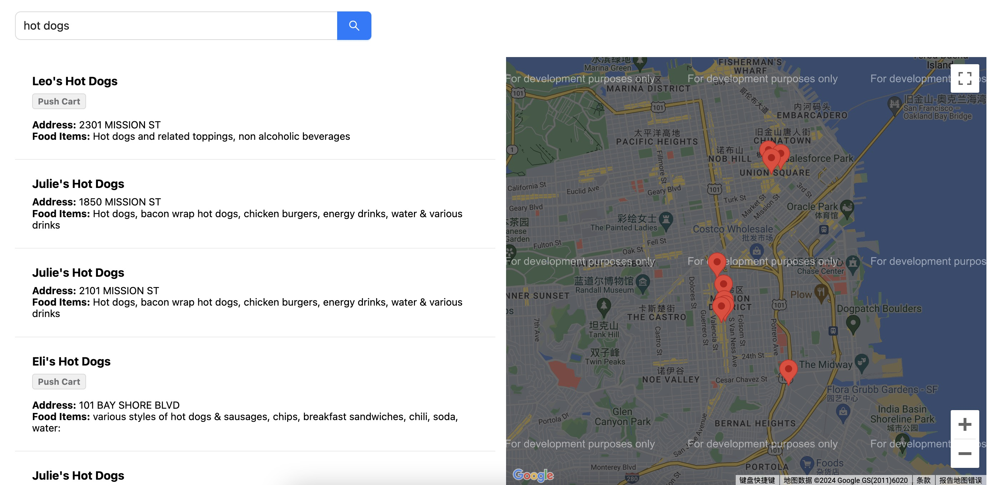

# Engineering Assessment

# Project Introduction
This is a project about retrieving San Francisco food truck cuisine. It involves front-end and back-end development. The front-end is developed based on Vue, while the back-end utilizes PHP, Swoole, and Elasticsearch for data storage services.

# Prepare Enviroment
1. docker and docker-compose
2. node > v20

# How To Start
1. clone the repo and `cd` into it
2. run the command `docker-compose up -d` to start api server and elasticsearch server
3. `cd` the dir `web` to start front-end server
4. run `npm install`
5. run `npm run serve` to start the server
